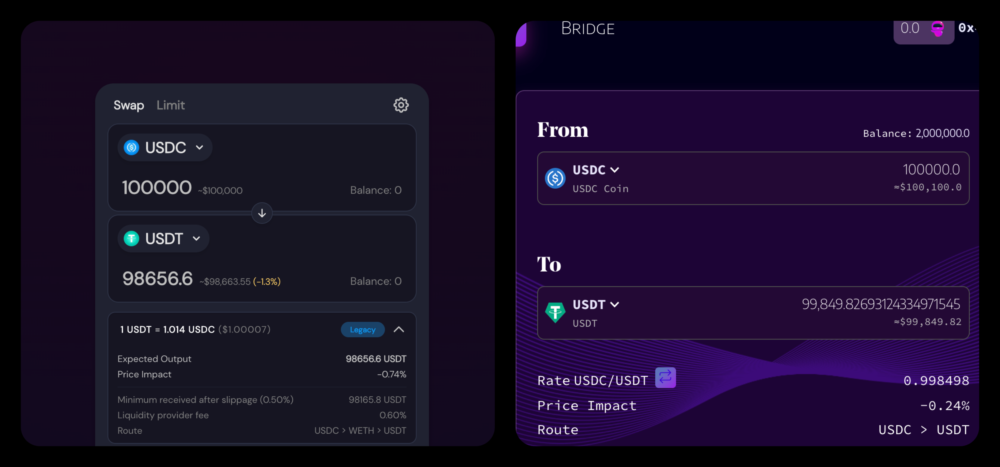

# Overview


**Good to know:** Jioswap is designed for low-slippage trading of stablecoins and other pegged assets on Multiple Blockchains .enabling cheap, efficient, and swift swaps for traders and high-yield pools for Liquidity Providers (LPs). Jioswap allows its users to earn compound interest on their crypto holdings. For example if you have any amount of BTC, or USDT, USDC or any stable coin sitting  in your crypto wallet, you can provide it as liquidity on Jioswap and earn interest each time a trade happens on the platform. :tada:


## HIGHLIGHTS

## Multi-chain

Jioswap supports multiple EVM blockchain networks. Bad user experience is one of the most critical issues in accelerating adoption of DeFi for the everyday person. High gas fees on Ethereum is obviously the most highlighted. however although Binance solves that issue it also has its cons. Jioswap aims to mitigate this by supporting numerous chains, ie: Fantom, Optimism Layer 2 etc.. each solving a particular issue for the end user. Giving the end user options that best suit  their needs for a specific transaction.

## Bridges

Jioswap bridges aims to support most EVM compatible chains that meets the volume requirements. However we are more focused on bridging layer1 & layer2 "Non-EVM" chains, enabling users who hold assets on those chains to bring their assets over, transact / interact with Defi applications and more.


**Good to know:** Bridges are permissionless applications that allow users to send tokens and arbitrary data between blockchain networks.


## Why is Jio Important?

If a DeFi user is looking to swap $100,000 USDC to USDT , considering there’s sufficient amount of liquidity to do so. Using the traditional AMM such as Sushiswap, PancakeSwap, yokai swap etc. the minimum you’d receive would be roughly $98165.8 USDT and maximum would be around $98656.6 losing $1343.40 to $1834.2 in value. If you were to use Jioswap instead, you’d receive $99,849.8269 — almost zero slippage. Jio’s protocol is specifically designed for pegged assets, and as a result, it is much more efficient than an AMM such as Sushiswap that is not optimized to do so.

## EARN

Earn trading fees by providing liquidity and staking your tokens in Liquidity Pools (LPs).

